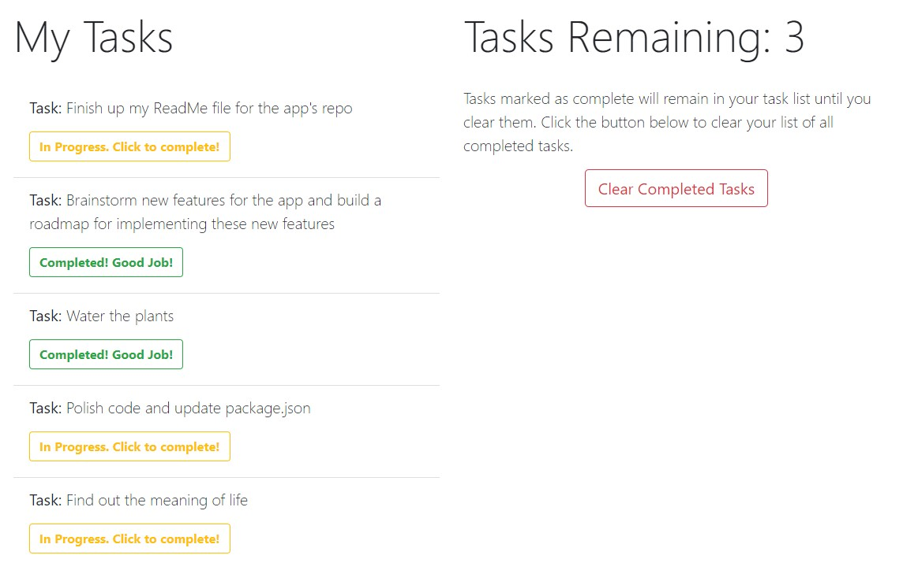

# ThundrBolt: Task management done lightning quick!

### To see the app in action, [click here!](https://thundrbolt.vercel.app/) App is currently deployed via Vercel.

## About:

### What is ThundrBolt?

ThundrBolt is a free task management application for anybody who likes to visualize, organize and manage their tasks in one convenient web application. In a rush? No worries! ThundrBolt doesn't require you to create an account, doesn't require any form of payment or commitment, and runs entirely in your browser with no installations required at all.

### Why make ThundrBolt?

As somebody who struggles with his mental health, it's hard to take the steps necessary to take back control of my life. Commitments that may seem small to some, appear much larger to others. Creating accounts, paying money or downloading software can be a hefty task for something you're already struggling to implement. ThundrBolt exists for people like me, like us; those who want to take baby-steps to taking back control of their life. ThundrBolt was the first step for me to take more accountability for myself, and I'm hoping that at least one other person can do the same.

### Why choose ThundrBolt?

The internet has become bloated with technology that serves us at a cost. Whether that cost be money, time, data or frustration, we pay for tools to make our lives easier. We find ourselves striving for convenience, as inconvenient as it may be! ThundrBolt takes away those costs. It runs entirely in your browser so you don't need to download anything. It's 100% free, so you don't need to pay any fees or subscription costs, and above all it's easy to use! Simply log tasks you need to complete, mark them as complete, and go on with your day.

### What's next for ThundrBolt?

I'll try my best to update this section as I develop the app further. I have several features I'd like to implement, ranging from small QoL tweaks, to fundamental changes to the app that expand its total functionality. Features on my radar (in no particular order of importance, difficulty or other) include:

- Adding additonal inputs to the task form, allowing for optional details to be included for each task.
- Adding the ability to mark certain tasks as priority, moving them to the top of the list.
- Adding date and time features to add time management, such as due dates, time constraints and more.
- Adding a seperate list for completed tasks.
- Adding a separate list for tasks that are currently being worked on. This would convert ThundrBolt into a Kanban-style app.

## Features

ThundrBolt boasts several features that make it work so well. Below I'll break down a few of these features, and hope to add more as I further Develope it!

## Simple & Clean Dashboard

Fresh, clean and simple, the dashboard is as elegant as it is easy on the eyes. Everything you need is at a glance, from where you type your tasks, to where they are listed, to information about your task list, including how many you have left and a way to clear your completed tasks! As you add tasks, they cleanly stack in your task list as shown below.

## Organized Task List

Tasks neatly line up in their own list, single-file and evenly spaced. The calm and refreshing layout inspires organization. You'll want to fill your day with tasks! Each task adorns its own button that shows the status. Need to circle back to a previously completed task? No worries! The button toggles, so you're free to mark completed tasks as in-progress if needed.  

## Intuitive Design

Tasks remain in your task list as a way to motivate you. As you see the yellow progress buttons turn green, you can witness your productivity in real time. The color-coordination allows for easy deciphering of task status. Next to the task list is the task Control Center. At this time, you're able to view the number of tasks you have left to complete, along with a button that allows you to clear completed tasks. That way, you're able to clear some of the clutter and keep your list as tidy as you like!

## Stored in local memory

Tasks that you create are stored in your browser's history. No need to keep a paper log or keep the tab open. You can close the tab, reopen and refresh the page, and your task will remain!

## Technology/Concepts Used

- JavaScript ES6
- ReactJS, including the use of state, effect hooks and ref.
- Bootstrap v4
- Single-responsibility principle: Modifiable and Reusable components.
- Vercel for deployment
