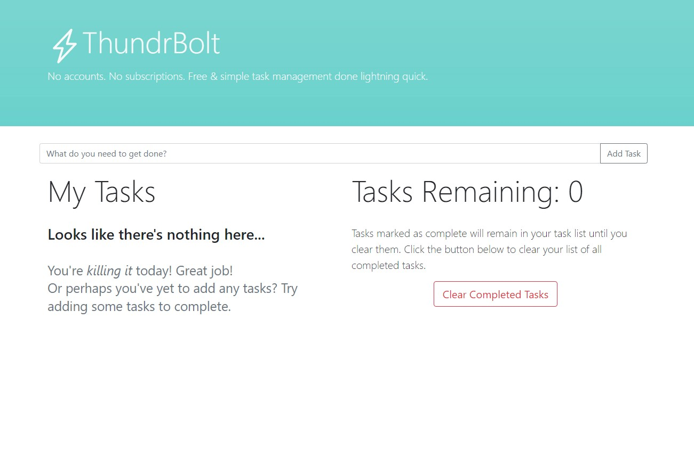
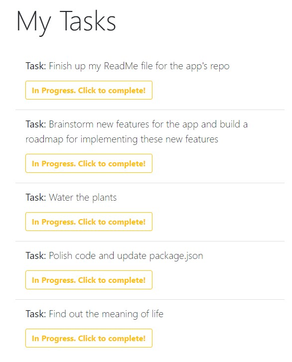

# ThundrBolt: Task management done lightning quick!

## About:

### What is ThundrBolt?

ThundrBolt is a free task management application for anybody who likes to visualize, organize and manage their tasks in one convenient web application. In a rush? No worries! ThundrBolt doesn't require you to create an account, doesn't require any form of payment or commitment, and runs entirely in your browser with no installations required at all.

Fresh, clean and simple, the dashboard is as elegant as it is easy on the eyes. Everything you need is at a glance, from where you type your tasks, to where they are listed, to information about your task list, including how many you have left and a way to clear your completed tasks! As you add tasks, they cleanly stack in your task list as shown below.

### Why choose ThundrBolt?

The internet has become bloated with technology that serves us at a cost. Whether that cost be money, time, data or frustration, we pay for tools to make our lives easier. We find ourselves striving for convenience, as inconvenient as it may be! ThundrBolt takes away those costs. It runs entirely in your browser so you don't need to download anything. It's 100% free, so you don't need to pay any fees or subscription costs, and above all it's easy to use! Simply log tasks you need to complete, mark them as complete, and go on with your day.

### `npm run build`

Builds the app for production to the `build` folder.\
It correctly bundles React in production mode and optimizes the build for the best performance.

The build is minified and the filenames include the hashes.\
Your app is ready to be deployed!

See the section about [deployment](https://facebook.github.io/create-react-app/docs/deployment) for more information.

### `npm run eject`

**Note: this is a one-way operation. Once you `eject`, you can't go back!**

If you aren't satisfied with the build tool and configuration choices, you can `eject` at any time. This command will remove the single build dependency from your project.

Instead, it will copy all the configuration files and the transitive dependencies (webpack, Babel, ESLint, etc) right into your project so you have full control over them. All of the commands except `eject` will still work, but they will point to the copied scripts so you can tweak them. At this point you're on your own.

You don't have to ever use `eject`. The curated feature set is suitable for small and middle deployments, and you shouldn't feel obligated to use this feature. However we understand that this tool wouldn't be useful if you couldn't customize it when you are ready for it.

## Learn More

You can learn more in the [Create React App documentation](https://facebook.github.io/create-react-app/docs/getting-started).

To learn React, check out the [React documentation](https://reactjs.org/).

### Code Splitting

This section has moved here: [https://facebook.github.io/create-react-app/docs/code-splitting](https://facebook.github.io/create-react-app/docs/code-splitting)

### Analyzing the Bundle Size

This section has moved here: [https://facebook.github.io/create-react-app/docs/analyzing-the-bundle-size](https://facebook.github.io/create-react-app/docs/analyzing-the-bundle-size)

### Making a Progressive Web App

This section has moved here: [https://facebook.github.io/create-react-app/docs/making-a-progressive-web-app](https://facebook.github.io/create-react-app/docs/making-a-progressive-web-app)

### Advanced Configuration

This section has moved here: [https://facebook.github.io/create-react-app/docs/advanced-configuration](https://facebook.github.io/create-react-app/docs/advanced-configuration)

### Deployment

This section has moved here: [https://facebook.github.io/create-react-app/docs/deployment](https://facebook.github.io/create-react-app/docs/deployment)

### `npm run build` fails to minify

This section has moved here: [https://facebook.github.io/create-react-app/docs/troubleshooting#npm-run-build-fails-to-minify](https://facebook.github.io/create-react-app/docs/troubleshooting#npm-run-build-fails-to-minify)
